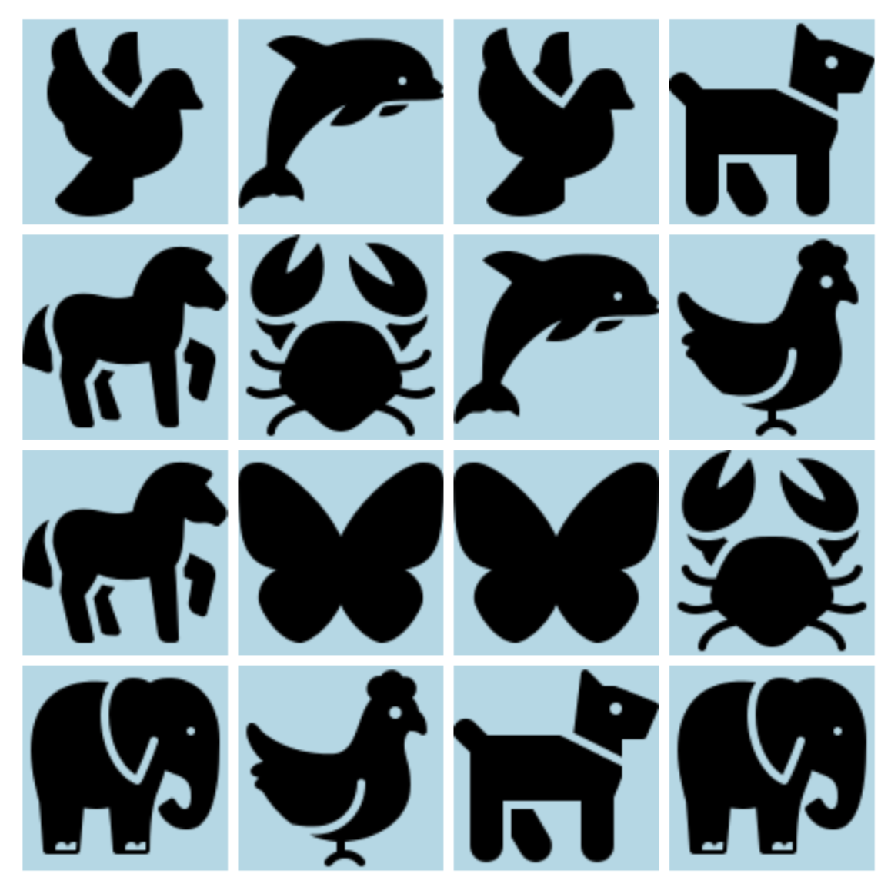

## Memorize Game

- Initially, all the tiles are face down.
- Click on a tile to turn it face-up.
- Now, click on another tile that you believe contains the same image as the one you just turned face-up.
- If both the images are same, they stay face-up.
- If the images aren't same they both turn face-down and you get another shot at guessing.
